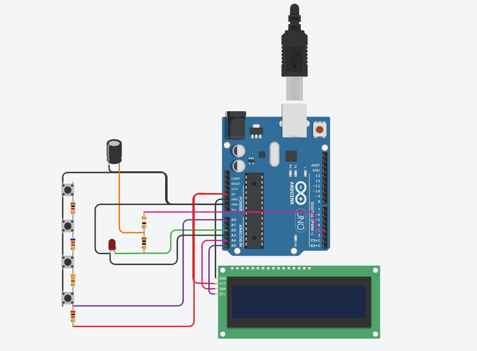
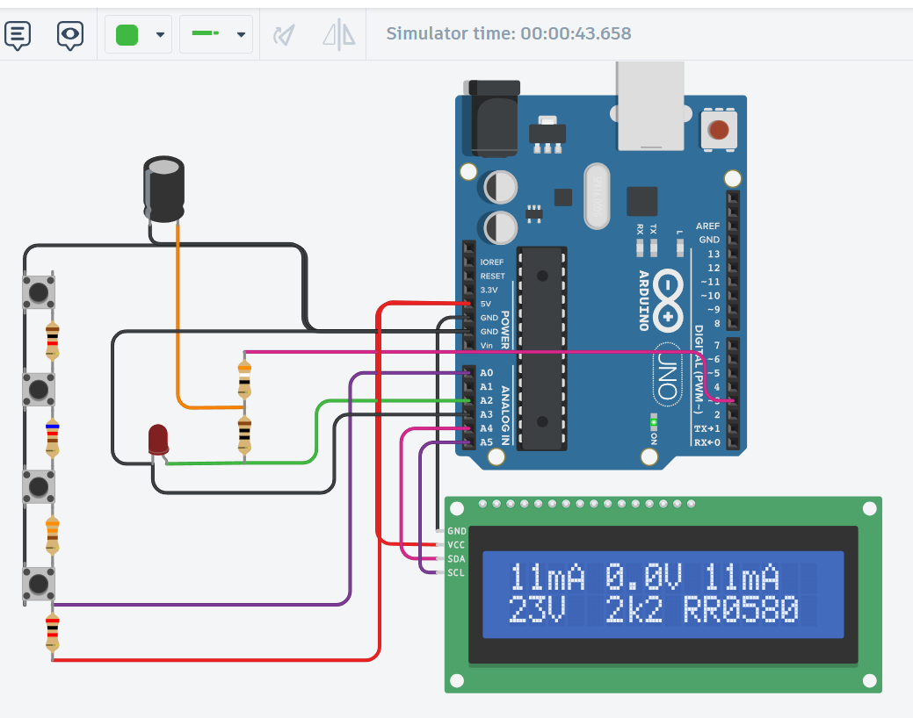

# Arduino LED Tester + Resistor Calculator

Arduino-based LED tester and series resistor calculator. Displays LED forward voltage, measured current, and recommends the nearest E24 resistor value with Jaycar part number for a user-defined supply voltage. Features I2C LCD display, push button controls, and serial monitor logging.

---

## Table of Contents
- [About](#about)
- [Features](#features)
- [Hardware Requirements](#hardware-requirements)
- [Circuit Diagram](#circuit-diagram)
- [Pin Configuration](#pin-configuration)
- [How It Works](#how-it-works)
- [LCD Display Layout](#lcd-display-layout)
- [Serial Monitor Output](#serial-monitor-output)
- [Button Controls](#button-controls)
- [Installation](#installation)
- [Credits](#credits)
- [License](#license)

---

## About

This project is a handy bench tool for electronics hobbyists to quickly characterize LEDs and calculate the correct series resistor for any supply voltage. Simply plug in an LED, set your target current (1–20mA) and supply voltage (1–99V) using the push buttons, and the device will measure the LED's forward voltage and recommend the nearest standard E24 resistor value along with its Jaycar Electronics part number.

Built around an Arduino Uno/Nano with an I2C 16x2 LCD display, it provides real-time readings on both the LCD and the serial monitor.

Originally inspired by Dave Cook's design and Mirko Pavleski's Hackster.io project, with modifications for I2C LCD support, dedicated push button navigation, serial monitor logging, and a welcome screen on startup.

---

## Features

- Measures LED forward voltage in real time
- Measures and controls LED current (1–20mA range)
- Calculates required series resistor for any supply voltage (1–99V)
- Recommends nearest E24 standard resistor value
- Displays Jaycar Electronics part number for recommended resistor
- Warns if resistor power dissipation exceeds 0.5W
- I2C 16x2 LCD display with welcome screen on startup
- Push button navigation for current and voltage adjustment
- Serial monitor logging with startup diagnostics
- Reverse polarity safe — LED won't be damaged if connected backwards

---

## Hardware Requirements

| Reference | Component | Quantity | Notes |
|-----------|-----------|----------|-------|
| U1 | Arduino Uno R3 | 1 | Microcontroller |
| U2 | I2C 16x2 LCD Display | 1 | PCF8574-based, address 0x27 |
| SI+, SV+, SV-, SI- | Pushbutton | 4 | Current up/down, Voltage up/down |
| RR3 | 39Ω Resistor | 1 | Series resistor on PWM output |
| RR5_SENSE | 10Ω Resistor | 1 | Current sense resistor |
| RR21 | 330Ω Resistor | 1 | Button network |
| RR | 620Ω Resistor | 1 | Button network |
| RR1 | 1kΩ Resistor | 1 | Button network |
| RR2 | 2kΩ Resistor | 1 | Button network |
| C1 | 470µF Polarized Capacitor | 1 | 14V rating, smoothing capacitor |
| D1 | Red LED | 1 | Test LED (replaceable with any LED) |

---

## Circuit Diagram



> Full schematic PDF is available in the `/schematics` folder.

---

## Pin Configuration

| Arduino Pin | Function |
|-------------|----------|
| D3 (PWM) | Current driver output (DPIN) |
| A0 | Button input (KEYPIN) |
| A2 | Analog top of sense resistor (ATOP) |
| A3 | Analog bottom of sense resistor (ABOT) |
| A4 (SDA) | I2C LCD Data |
| A5 (SCL) | I2C LCD Clock |

---

## How It Works

1. The Arduino drives a PWM signal through a 39R resistor and 470µF capacitor to deliver a smooth current through the test LED
2. A 10R sense resistor measures the actual current flowing through the LED
3. Analog pins A2 and A3 measure the voltage at either end of the sense resistor
4. The difference gives the voltage across the sense resistor, and dividing by 10 gives the current in mA
5. The PWM duty cycle is adjusted in a control loop to match the user's target current
6. Once stable, the LED forward voltage and current are displayed
7. The required series resistor is calculated as `(vset - vled) / itest`
8. The nearest E24 standard value is looked up and displayed with its Jaycar part number

---

## LCD Display Layout

**On startup:**
```
   RES CALC
  LED  TESTER
```

**During operation:**
```
10mA  2.1V  10mA
14V   1k2  RR0574
```

| Field | Description |
|-------|-------------|
| `10mA` (top left) | Target test current |
| `2.1V` (top centre) | Measured LED forward voltage |
| `10mA` (top right) | Actual measured current |
| `14V` (bottom left) | Set supply voltage |
| `1k2` (bottom centre) | Recommended resistor value |
| `RR0574` (bottom right) | Jaycar part number |

> If the resistor would dissipate more than 0.5W, `P` flashes on the top line and `!` appears on the bottom line as a warning.

---

## Serial Monitor Output

Set baud rate to **9600** in the Arduino IDE serial monitor.

**On startup:**
```
=== Arduino LED Tester + Resistor Calculator ===
Initializing...
[OK] I2C LCD found at address 0x27
[OK] PWM output pin D3 ready
[OK] Analog sense pins A2 (ATOP) and A3 (ABOT) ready
================================================
RAW=analog counts | MEAS=measured values | SET=user settings | CALC=calculated results
================================================
```

**During operation (every 500ms):**
```
PWM:120 | RAW: ATOP=650 ABOT=430 | MEAS: vled=2100mV vrr=107mV irr=10mA irf=10mA | SET: itest=10mA vset=14000mV | CALC: rval=1200R rindex=48 rvalid=1
```

**On button press:**
```
[BTN] RIGHT pressed -> itest=11mA
[BTN] UP pressed    -> vset=15V
```

---

## Button Controls

| Button | Function |
|--------|----------|
| LEFT | Decrease target current by 1mA |
| RIGHT | Increase target current by 1mA |
| UP | Increase supply voltage by 1V |
| DOWN | Decrease supply voltage by 1V |

- Target current range: **1mA to 20mA**
- Supply voltage range: **1V to 99V**

---

## Screenshots

### LCD Display During Operation



---

## Installation

1. Clone this repository:
```bash
   git clone https://github.com/ashwinsharma/arduino-led-tester.git
```
2. Open `src/arduino-led-tester.ino` in Arduino IDE
3. Install the `LiquidCrystal_I2C` library via Arduino Library Manager
4. Select your board: **Arduino Uno** or **Arduino Nano**
5. Select the correct COM port
6. Upload the sketch
7. Open Serial Monitor at **9600 baud**

---

## Credits

- **Dave Cook** — Original LED tester concept and circuit design
- **Mirko Pavleski** — Arduino adaptation with I2C LCD, published on [Hackster.io](https://www.hackster.io) (November 2023)
- **Ashwin Sharma** — Tinkercad simulation, serial monitor logging, welcome screen, button navigation messages, and code documentation

---

## License

This project is licensed under the **GNU General Public License v3.0 (GPL-3.0)**, in accordance with the original project's license.

See the [LICENSE](LICENSE) file for full details.

> You are free to use, modify, and distribute this project, provided that any derivative works are also licensed under GPL-3.0 and credit is given to the original authors.
